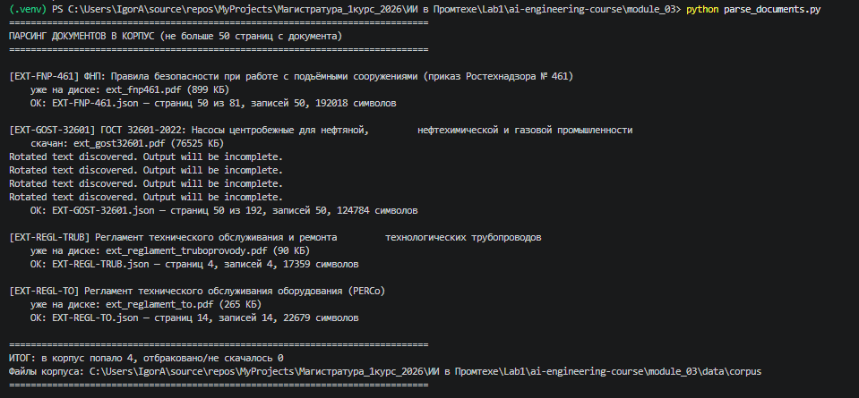
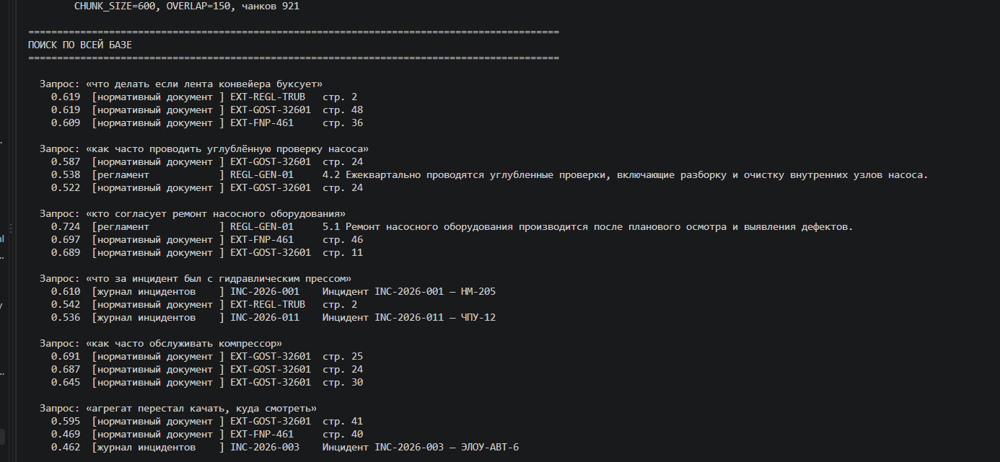
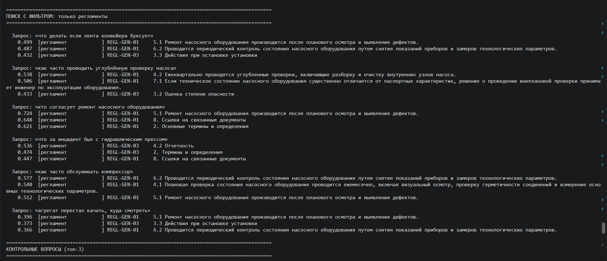
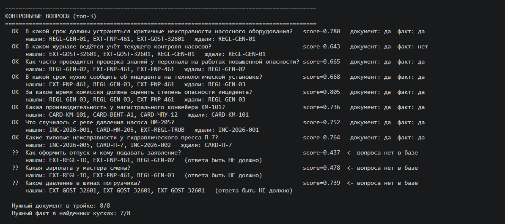
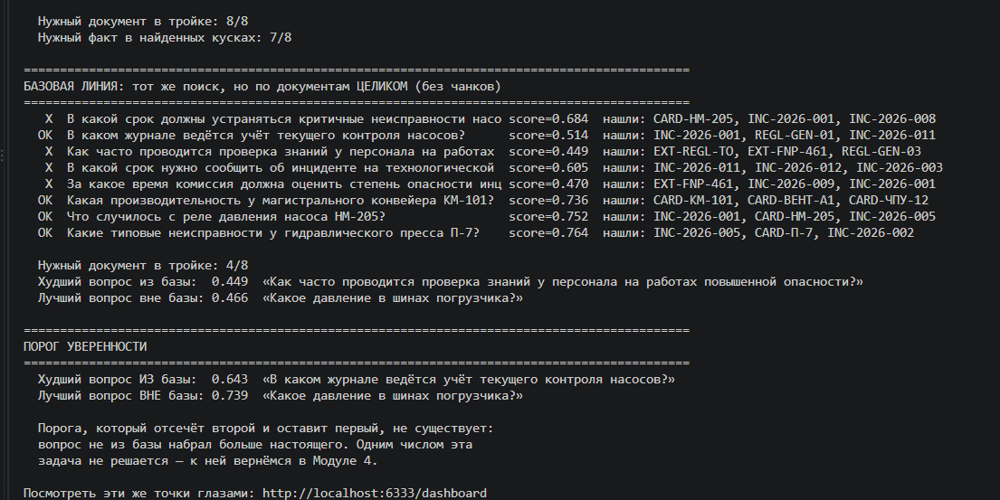
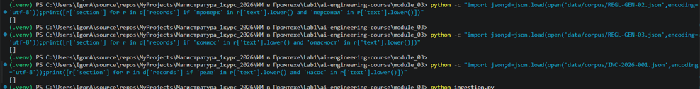
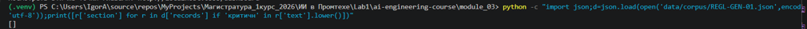

Ответы нейросети представлены в файле answers.txt в папке module_01

При первом вызове модели с вопросом "Приведи 5 основных причин неисправности лазерного станка и меры восстановления для каждого случая" возникла ситуация нехватки токенов (max_tokens оказался слишком маленьким).
После увеличения до 1000 ответ уместился полностью (709 токенов было истрачено, из них 673 на выходе), поэтому за основу было взято количество max_tokens, равное 1000.

1. Чем отличались ответы при температуре 0.0 и 1.0?
При использовании температуры 0.0 освновные причины, выведенные в ответе, были практически полностью одинаковыми (названия 1,2 и 3 не отличались, названия 4 и 5 отличались лишь в формулировке), описание причин неисправности лазерных станков также схожим образом. При использовании температуры 1.0 появилась большая вариативность (особенно для 4 и 5 вопросов). Например, второй ответ содержал более развернутое описание проблем с подшипниками и программным обеспечением как возможных причин неисправностей. Это подтверждает тезис о том, что низкая температура приводит к меньшей вариабельности в ответе, а высокая, наоборот, увеличивает случайность.

2. Что произошло при MAX_TOKENS = 50 и как это было видно в выводе?
Ответы стали обрываться на полуслове (причина остановки - length). Кроме того, появлялось сообщение "ответ обрезан по лимиту max_tokens — увеличь MAX_TOKENS". Как правило, не хватало и 500 токенов, поэтому было выбрано значение 1000, что, по всей видимости, связано с особенностью самого вопроса. После этого все ответы модели вмещались в эти рамки.

3. Как смена роли повлияла на ответ? Какую роль ты бы выбрал для помощника по регламентам и почему?
При указании роли "Ты - терпеливый наставник, объясняешь как новичку, с примерами." модели повысила расход токенов, что является не самым желательным последствием, особенно в условиях жестких ограничений, но при этом ответ стал более развернутым и понятным. Для роли "Ты - строгий технический специалист, отвечаешь кратко и по делу." ответ уместился в 174 токена (более чем в 4 раза меньше), но ответ стал более кратким. Я бы выбрал со строгим техническим специалистом, если нужно соблюдать официальность стиля текста и как-то использовать нейросеть в производственном процессе, но при этом, наверное, при личном использовании задавал роли и вопросы как к "наставнику".

## Практика 1. Классификация обращений

| Стратегия | Точность |
|-----------|----------|
| zero-shot | 11/12     |
| few-shot  | 12/12    |

### Ответы на вопросы

1. Какая стратегия точнее и почему?
few-shot стратегия оказалась точнее, связано с тем, что добавлены конкретные примеры, на которых модель промахивается, что помогает повысить точность ответов.

2. На каких обращениях модель ошибалась даже с примерами? Что у них общего?
При few-shot стратегии ошибок не было.

3. Сколько токенов съел один прогон и во что это превратится на 1000 обращений в день?
В каждом запуске (24 вызова) было истрачено 1652 токена. При 1000 подобных обращений будет потрачено примерно 68833 токена - средние накладные расходы.

## Раздел по практике 2

### Ответы на вопросы

1.	Где этот подход ломается? Какие обращения он разберёт неправильно, и человек об этом даже не узнает?
Такой подход защищает только от синтаксически некорректного ответа (неправильная схема, нет категории в перечне и т.д.). Ломается, если система указывает категорию, которая есть в перечне, но на самом деле сообщение было не об этом.
Кроме того, подход может пропустить случаи инъекции (как вариант, если неправильно настроены запросы)

2.	В каких случаях заявку обязан посмотреть специалист, а не система?
В тех случаях, если ломается схема ответа (например, неправильный формат) или если была указана категория, которой нет в реестре (например, указан тип оборудования, который не был найден) (то есть если есть какая-то ошибка).
Но проверки могут потребоваться и в иных случаях - модели могут ошибаться, и без проверок многие спорные обращения могут быть не обнаружены.

## Занятие 5

МОДЕЛЬ: all-MiniLM-L6-v2
Для близких пар значения получились равны 0.711, 0.700, 0.683, 0.816. Для пар, которые должны быть далеки, - 0.616, 0.721 (Конвейер остановился и вопрос про оформление отпуска), 0.499 и 0ю737 (Станок заело, подшипники не двигаются - Как получить ключ доступа для входа)

  Худшая близкая пара : 0.683
  Лучшая далёкая пара : 0.737
  ЗАЗОР               : -0.054

Таким образом, модель сработала плохо, хороший поиск на ней построить нельзя.
Для ложных совпадений:
Ложные совпадения (общие слова, разный смысл):
    0.650   Высокое давление в гидросистеме пр <-> Высокое давление в коллективе и те
    0.642   Пуск конвейера после ремонта       <-> Пуск приложения аутентификации
    0.705   Лента конвейера не двигается       <-> Хранилище измерительных лент  <- модель попалась

МОДЕЛЬ: paraphrase-multilingual-MiniLM-L12-v2

Для близких пар: 0.644, 0.639, 0.453, 0.623. Для далеких - 0.019, 0.045, 0.005, -0.096

  Худшая близкая пара : 0.453
  Лучшая далёкая пара : 0.045
  ЗАЗОР               : +0.407

Результаты получились намного лучше.
Для ложных совпадений:
    0.419   Высокое давление в гидросистеме пр <-> Высокое давление в коллективе и те
    0.064   Пуск конвейера после ремонта       <-> Пуск приложения аутентификации
    0.274   Лента конвейера не двигается       <-> Хранилище измерительных лент

Пример попытки распознавания скана:
python parse_documents.py --local C:/docs                   

ПАРСИНГ ДОКУМЕНТОВ В КОРПУС (не больше 50 страниц с документа)

[1/1] sample-scanned.pdf
    ОТБРАКОВАН: sample-scanned.pdf — в PDF нет текстового слоя (это скан: 0 симв. на 2 стр.).
    Такой файл нужно сначала распознать (OCR) — в этом задании сканы не обрабатываем.

ИТОГ: в корпус попало 0, отбраковано/не скачалось 1

Примеры запусков - в папке со скриншотами и на изображениях ниже
Генератор, загрузчик, замер моделей, парсер, пример скана

## Занятие 6

Эталонный корпус
|CHUNK_SIZE / OVERLAP|Чанков|Нужный документ|Нужный факт|
|-----|------|-----|------|
|300 / 150|2600|8 / 8|5 / 8|
|400 / 0|1028|6 / 8|6 / 8|
|400 / 100|1337|8 / 8|7 / 8|
|600 / 0|715|8 / 8|7 / 8|
|600 / 150|921|8 / 8|7 / 8|
|1000 / 200|563|7 / 8|7 / 8|
|целиком, без чанков|28|4 / 8| - |

7/8 (контрольные вопросы, 600/150): ожидался REGL-GEN-01, однако он в итоге оказался только третьим, поэтому по второй метрике 7/8.
При работе с документами целиком результат получился хуже, так как вектор целевого документа усредняет смысл всех разделов и не совпадает ни с одним конкретным вопросом

Провал порога
|Параметры|Худший вопрос из базы|Лучший вопрос вне базы|
|-----|------|-----|
|400 / 0|0.663 (учет текущего контроля насосов)|0.728 (давление в шинах...)|
|400 / 100|0.647|0.783|
|600 / 150|0.643|0.739|

MIN_SCORE = 0.3 (объяснение порога ниже)

Первая метрика упирается в потолок (8 из 8), вторую разводят. Выбрана комбинация 600/150 (показатели не отличимы от 600/0, но здесь есть защита от потери предложения на границе).
Базовая линия на всех прогонах составляет 4/8 (хуже, чем с чанками).

Свой корпус
|CHUNK_SIZE / OVERLAP|Чанков|Нужный документ|Нужный факт|
|-----|------|-----|------|
|300 / 150|2576|4 / 8|0 / 8|
|400 / 0|1016|3 / 8|0 / 8|
|400 / 100|1328|4 / 8|0 / 8|
|600 / 0|709|4 / 8|0 / 8|
|600 / 150|906|4 / 8|0 / 8|
|1000 / 200|556|3 / 8|0 / 8|

Число попаданий упало, однако размер чанка здесь ни при чем: причина в том, что модель написала документы другими словами.
Пример: вопрос "В какой срок должны устраняться критичные неисправности насосного оборудования?" ждет REGL-GEN-01, но в нем не оказалось ни одной записи со словом "критичн".
По факту в документе было написано следующее: "Аварийная остановка насоса производится при достижении порога давления свыше 1,6 МПа.\n- Информация о срабатывании сигнализации передается ответственному инженеру немедленно."
Здесь, помимо всего прочего, не указаны конкретные сроки (например, "до 1 рабочего дня", как указано в файле с вопросами).
Другие примеры - на скриншотах

MIN_SCORE = 0.3 Ни один настоящий вопрос при таком значении не отсекается (однако и тот мусор, **который был в примерах**, также не отсекается). Более высокое значение не выбрал, чтобы не отсечь настоящие вопросы. Это выбор для тех случаев, если будут такие вопросы, **для которых score окажется совсем уж низким**. Обоснование: порог, который отсекает весь мусор, отсек бы и настоящие вопросы, поэтому отказ отвечать нужно решать не на основании одного лишь числе - значении порога.
Однако в целях минимизации потерь можно было бы поставить и 0.5 (отсекает вопросы про "отпуск", и не трогает настоящие вопросы).
При 0.6, скорее всего, отсекло бы "Что случилось с реле давления насоса HM-205?" (0.59), а при значении больше 0.7 отсекаются многие настоящие вопросы

Провал порога (порог уверенности)
|Параметры|Худший вопрос из базы|Лучший вопрос вне базы|
|-----|------|-----|
|300 / 150|0.591|0.766|
|400 / 0|0.595|0.728|
|400 / 100|0.595|0.783|
|600 / 0|0.595|0.763|
|600 / 150|0.595|0.739|
|1000 / 200|0.595|0.676|

Вопрос-ловушка про шины набирает больше худшего настоящего вопроса из базы при всех комбинациях, так что порог не поможет.
Базовая линия на всех прогонах составляет 5/8.

почему фильтр не заменить порогом?
Фильтр по типу отсекает по метаданным целый класс источников (например ГОСТ, который своим объемом глушит короткий регламент), а порог смотрит только на score, который может отражать близость слов, а не наличие ответа, поэтому нерелевантный чанк ГОСТа может набрать больше настоящего.

Найденный нахлест

